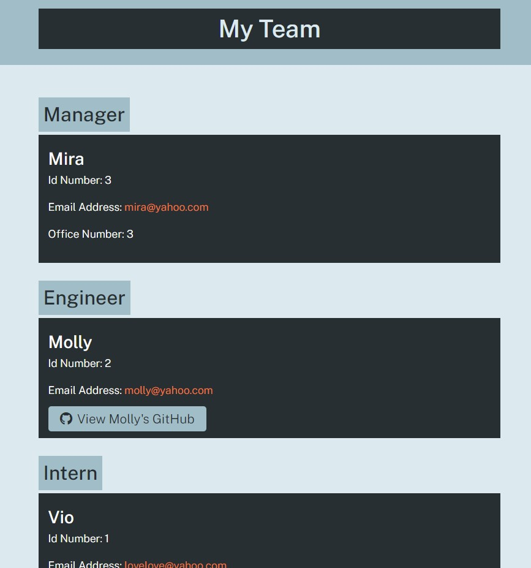

# Team Profile Generator

## Table of Contents

- [Installation](#installation)
- [Questions](#questions)
- [What I Learned](#what-i-learned)

## Description

This is a program that will ask you questions about your coding team. You will be asked to input the Mangers name and then upon completion of that you will then be asked to add as many Engineers and Interns until you feel you are done. Once finished, you select All Done and then the program will generate a webpage with all the information you submitted.

## Installation

First go into the terminal and type npm init. Then type npm install inquirer and you should be good to go. If you want to interact with the tests make sure to install jest by typing npm install --save-dev jest.

## What I Learned

This go around we learned about OOP, TDD and how to use another npm package known as jest. As my sixth JavaScript project I found this to still be a challenge. The biggest issue this go around was getting my head around how to use TDD properly and getting all these Tests to pass. Also I hit a little bump with .filter and .map to get them to display the boxes. As always I will keep pushing forward in an attempt to grow and improve.

## Questions

<a href="https://github.com/JohnKnee3">JohnKnee3's GitHub</a>

If you want to contact me please send me an email at john.a.clark3@gmail.com and I will get back to you as soon as possible.
